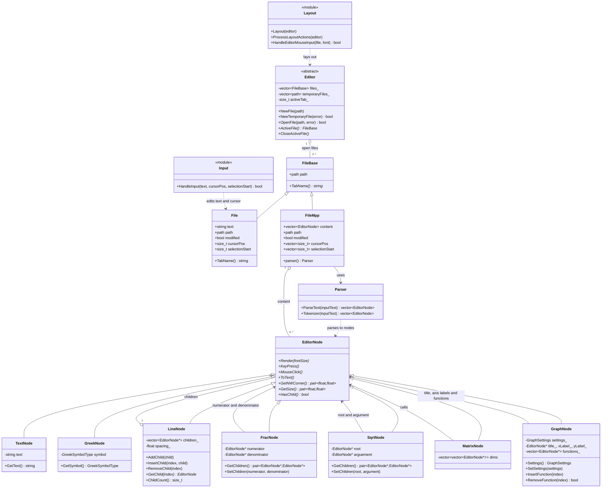

# Project UML

```mermaid

classDiagram
    direction UD
    class Editor {
        <<abstract>>
        -vector~FileBase~ files_
        -vector~path~ temporaryFiles_
        -size_t activeTab_
        +NewFile(path)
        +NewTemporaryFile(error) bool
        +OpenFile(path, error) bool
        +ActiveFile() FileBase*
        +CloseActiveFile()
    }

    class FileBase:::abstract {
        +path path
        +TabName() string*
    }

    class File {
        +string text
        +path path
        +bool modified
        +size_t cursorPos
        +size_t selectionStart
        +TabName() string
    }

    class FileMpp {
        +vector~EditorNode~ content
        +path path
        +bool modified
        +vector~size_t~ cursorPos
        +vector~size_t~ selectionStart
        +parser() Parser
    }

    class Layout {
        <<module>>
        +Layout(editor)
        +ProcessLayoutActions(editor)
        +HandleEditorMouseInput(file, font) bool
    }

    class Input {
        <<module>>
        +HandleInput(text, cursorPos, selectionStart) bool
    }

    class EditorNode:::abstract {
        +Render(fontSize)*
        +KeyPress()*
        +MouseClick()*
        +ToText()*
        +GetNWCorner() pair~float,float~*
        +GetSize() pair~float,float~*
        +HasChild() bool*
    }

    class LineNode {
        -vector~EditorNode*~ children_
        -float spacing_
        +AddChild(child)
        +InsertChild(index, child)
        +RemoveChild(index)
        +GetChild(index) EditorNode*
        +ChildCount() size_t
    }

    class TextNode {
        -string text
        +GetText() string
    }

    class GreekNode {
        -GreekSymbolType symbol
        +GetSymbol() GreekSymbolType
    }

    class FracNode {
        -EditorNode* numerator
        -EditorNode* denominator
        +GetChildren() pair~EditorNode*,EditorNode*~
        +SetChildren(numerator, denominator)
    }

    class SqrtNode {
        -EditorNode* root
        -EditorNode* arguement
        +GetChildren() pair~EditorNode*,EditorNode*~
        +SetChildren(root, argument)
    }

    class MatrixNode {
        -vector~vector~EditorNode*~~ dims
    }

    class GraphNode {
        -GraphSettings settings_
        -EditorNode* title_, xLabel_, yLabel_
        -vector~EditorNode*~ functions_
        +Settings() GraphSettings
        +SetSettings(settings)
        +InsertFunction(index)
        +RemoveFunction(index) bool
    }

    class Parser {
        +ParseText(inputText) vector~EditorNode~
        +Tokenizer(inputText) vector~EditorNode~
    }


    FileBase <|-- File
    FileBase <|-- FileMpp
    Editor "1" o-- "0..*" FileBase : open files
    Layout ..> Editor : lays out
    Input ..> File : edits text and cursor

    EditorNode <|-- LineNode
    EditorNode <|-- TextNode
    EditorNode <|-- GreekNode
    EditorNode <|-- FracNode
    EditorNode <|-- SqrtNode
    EditorNode <|-- MatrixNode
    EditorNode <|-- GraphNode
    LineNode "1" o-- "0..*" EditorNode : children
    FracNode --> EditorNode : numerator and denominator
    SqrtNode --> EditorNode : root and argument
    MatrixNode --> EditorNode : cells
    GraphNode --> EditorNode : title, axis labels and functions

    Parser ..> EditorNode : parses to nodes
    FileMpp "1" o-- "0..*" EditorNode : content
    FileMpp --> Parser : uses
```
